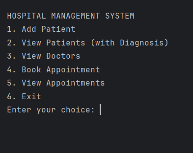
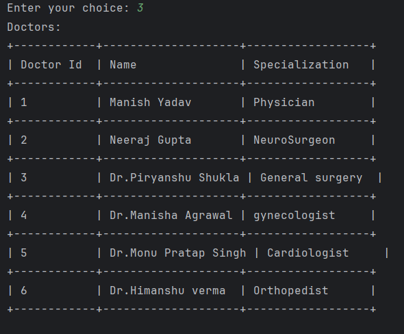
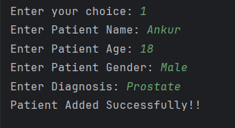
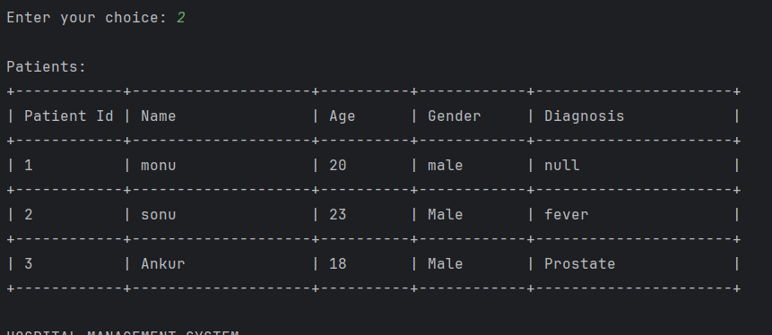
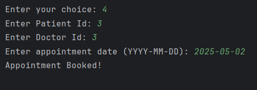
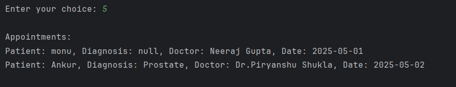
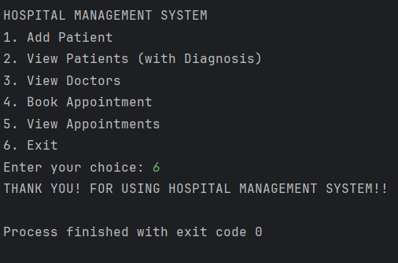

# 🏥 Hospital Management System

A **Java-based Hospital Management System** designed to manage patients, doctors, and appointments efficiently. This system operates with **MySQL as the database**, allowing users to perform CRUD operations, book appointments, and retrieve patient details seamlessly.

## ✨ Features

✔ **Add New Patients** - Register patients with name, age, gender, and diagnosis  
✔ **View Patients with Diagnosis** - Retrieve all patient details including their medical condition  
✔ **Manage Doctors** - View available doctors and their specializations  
✔ **Book Appointments** - Schedule patient-doctor appointments with date selection  
✔ **Check Doctor Availability** - Prevent double-booking on the same date  
✔ **View All Appointments** - See which doctor has an appointment with which patient  
✔ **Structured Database** - Uses **MySQL** to store patient records securely

## 📂 Project Structure
Hospital_Management_System/
├── src/                     # Java source code
│   ├── HospitalManagementSystem.java
│   ├── Doctor.java
│   ├── Patient.java
├── database/                # MySQL database setup file
│   ├── database_setup.sql
├── screenshots/             # UI screenshots
│   ├── hospital_management_system.png
│   ├── view_doctors.png
│   ├── add_patients.png
│   ├── view_patients.png
│   ├── book_appointment.png
│   ├── view_appointments.png
│   ├── exit.png
├── README.md                # Project documentation
├── .gitignore               # Ignore unnecessary files
├── Hospital_Management_System.iml

## 📸 Screenshots
These images demonstrate the core functionality of the Hospital Management System.

### **1️⃣ Main Dashboard**
_Central screen of the Hospital Management System._  

### **2️⃣ View Doctors**
_Lists all available doctors and their specializations._  

### **3️⃣ Add Patients**
_Form for adding a new patient along with diagnosis details._  

### **4️⃣ View Patients**
_Show all registered patients with their medical history._  

### **5️⃣ Book Appointment**
_Interface for scheduling a doctor-patient appointment._  

### **6️⃣ View Appointments**
_Display scheduled appointments including patient and doctor details._  

### **7️⃣ Exit Screen**
_Final screen before exiting the system._  
